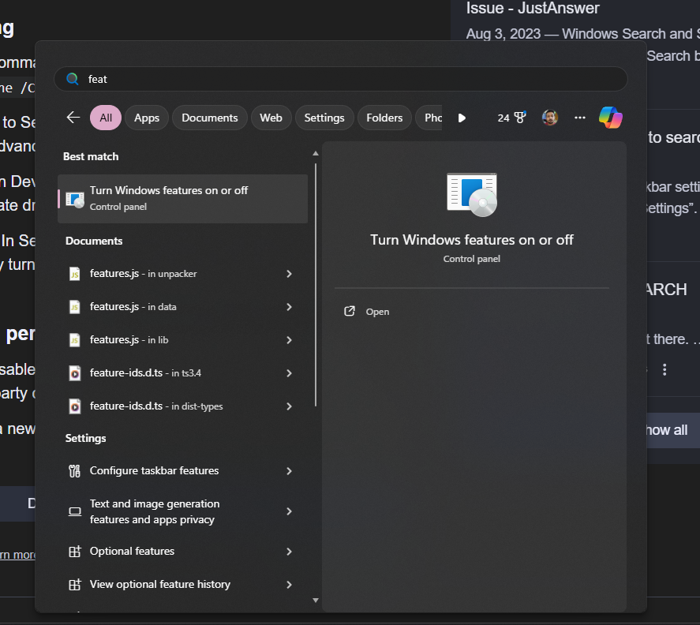
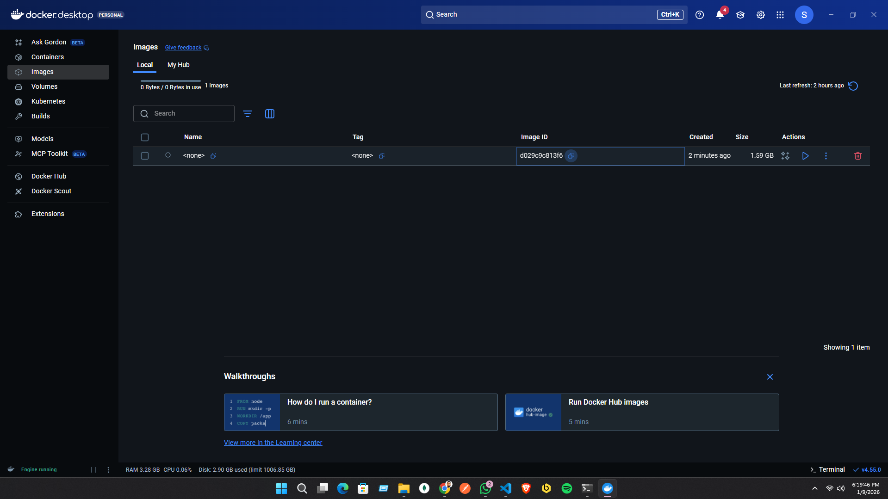
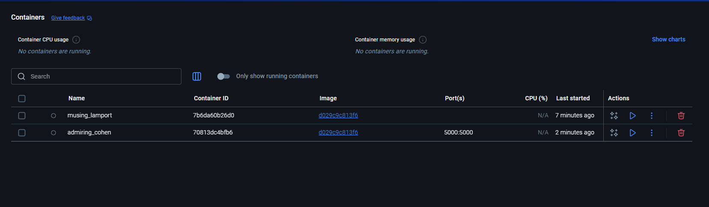

# DOCKER-IMAGE-AND-CONTAINER
Docker Cheat Sheet: https://find-saminravi99.notion.site/Docker-Cheat-Sheet-10dc48b8ac8c80b79f73ece2abfc6841?pvs=4

GitHub Link:
https://github.com/Apollo-Level2-Web-Dev/docker-with-typescript-backend/tree/module-2


## WSL Cheat Sheet

### **Checking WSL Installation**

1. **List Installed Distributions**:
    
    ```bash
    wsl --list --all
    
    ```
    
2. **List Running Distributions**:
    
    ```bash
    wsl --list --running
    
    ```
    
3. **Check Available Online Distributions**:
    
    ```bash
    wsl --list --online
    
    ```
    
4. **Check WSL Version**:
    
    ```bash
    wsl --list --verbose
    
    ```
    
5. **Check if WSL Feature is Enabled**:
    
    ```bash
    dism.exe /Online /Get-Feature /All | find "Microsoft-Windows-Subsystem-Linux"
    
    ```
    

### **Installing a New Distribution**

1. **Install a Distribution**:
(Replace `<distro-name>` with the name of the distribution, e.g., `Ubuntu`.)
    
    ```bash
    wsl --install -d <distro-name>
    
    ```
    

### **Uninstalling a Distribution**

1. **Unregister (Uninstall) a Distribution**:
    
    ```bash
    wsl --unregister <distro-name>
    
    ```
    
2. **Check for Remaining Files**:
    - Path: `C:\\Users\\<your-username>\\AppData\\Local\\Packages\\<distro-folder>\\LocalState\\`
    - Ensure no `.vhdx` files remain.

### **Uninstalling WSL Completely**

1. **Remove Installed Distributions**:
    - Go to **Settings** → **Apps** → **Apps & Features** and uninstall each distribution.
2. **Disable WSL Feature**:
    - Open **Windows Features** (`optionalfeatures.exe`).
    - Uncheck **Windows Subsystem for Linux** and **Virtual Machine Platform** (if applicable).
3. **Remove WSL Kernel Update**:
    - Go to **Settings** → **Apps** → **Apps & Features** and uninstall **Windows Subsystem for Linux Update**.

### **Starting WSL**

1. **Open a Distribution**:
    
    ```bash
    wsl -d <distro-name>
    
    ```
    
2. **Open from Start Menu**:
    - Search for the distribution (e.g., Debian, Ubuntu) in the Start Menu.

### **Logging Out of WSL**

1. **Logout Command**:
or
    
    ```bash
    exit
    
    ```
    
    ```bash
    logout
    
    ```
    

### **Terminating WSL**

1. **Terminate a Running Distribution**:
    
    ```bash
    wsl --terminate <distro-name>
    
    ```
    

### **Additional Tips**

- To update your WSL kernel manually, you can check [Microsoft's WSL documentation](https://docs.microsoft.com/en-us/windows/wsl/install) for the latest version.

---


# Docker Cheat Sheet

### **Getting Started with Docker**

1. **Check Docker Installation**:
    
    ```bash
    docker --version
    
    ```
    

### **Basic Commands**

1. **Pull an Image from Docker Hub**:
    
    ```bash
    docker pull <image-name>
    
    ```
    
    Example:
    
    ```bash
    docker pull ubuntu
    
    ```
    
2. **List Available Images**:
    
    ```bash
    docker images
    
    ```
    
3. **Run a Container**:
    
    ```bash
    docker run -it <image-name>
    
    ```
    
    Example:
    
    ```bash
    docker run -it ubuntu
    
    ```
    
4. **Run a Container in Detached Mode**:
    
    ```bash
    docker run -d <image-name>
    
    ```
    
5. **Stop a Running Container**:
    
    ```bash
    docker stop <container-id>
    
    ```
    
6. **Start a Stopped Container**:
    
    ```bash
    docker start <container-id>
    
    ```
    
7. **Remove a Stopped Container**:
    
    ```bash
    docker rm <container-id>
    
    ```
    
8. **Remove an Image**:
    
    ```bash
    docker rmi <image-name>
    
    ```
    

### **Managing Containers**

1. **List Running Containers**:
    
    ```bash
    docker ps
    
    ```
    
2. **List All Containers (including stopped)**:
    
    ```bash
    docker ps -a
    
    ```
    
3. **View Container Logs**:
    
    ```bash
    docker logs <container-id>
    
    ```
    
4. **Execute a Command in a Running Container**:
    
    ```bash
    docker exec -it <container-id> <command>
    
    ```
    
    Example:
    
    ```bash
    docker exec -it <container-id> bash
    
    ```
    
5. **Inspect a Container**:
    
    ```bash
    docker inspect <container-id>
    
    ```
    

### **Networking**

1. **List Docker Networks**:
    
    ```bash
    docker network ls
    
    ```
    
2. **Create a New Network**:
    
    ```bash
    docker network create <network-name>
    
    ```
    
3. **Connect a Container to a Network**:
    
    ```bash
    docker network connect <network-name> <container-id>
    
    ```
    
4. **Disconnect a Container from a Network**:
    
    ```bash
    docker network disconnect <network-name> <container-id>
    
    ```
    

### **Volumes and Data Management**

1. **Create a Volume**:
    
    ```bash
    docker volume create <volume-name>
    
    ```
    
2. **List Volumes**:
    
    ```bash
    docker volume ls
    
    ```
    
3. **Remove a Volume**:
    
    ```bash
    docker volume rm <volume-name>
    
    ```
    
4. **Mount a Volume to a Container**:
    
    ```bash
    docker run -v <volume-name>:<container-path> <image-name>
    
    ```
    

### **Dockerfile and Building Images**

1. **Create a Dockerfile**:
Basic structure:
    
    ```
    FROM <base-image>
    MAINTAINER <your-name>
    COPY <source> <destination>
    RUN <command>
    CMD ["<executable>"]
    
    ```
    
2. **Build an Image from a Dockerfile**:
    
    ```bash
    docker build -t <image-name>:<tag> .
    
    ```
    
    Example:
    
    ```bash
    docker build -t myapp:latest .
    
    ```
    
3. **List Built Images**:
    
    ```bash
    docker images
    
    ```
    

### **Advanced Commands**

1. **Tag an Image**:
    
    ```bash
    docker tag <image-id> <new-image-name>:<tag>
    
    ```
    
2. **Push an Image to Docker Hub**:
    
    ```bash
    docker push <image-name>:<tag>
    
    ```
    
3. **Save an Image to a Tar File**:
    
    ```bash
    docker save -o <path-to-output-file> <image-name>
    
    ```
    
4. **Load an Image from a Tar File**:
    
    ```bash
    docker load -i <path-to-input-file>
    
    ```
    
5. **Docker Compose**:
    - **Start Services**:
        
        ```bash
        docker-compose up
        
        ```
        
    - **Stop Services**:
        
        ```bash
        docker-compose down
        
        ```
        
6. **Scale Services**:
    
    ```bash
    docker-compose up --scale <service-name>=<number>
    
    ```
    
7. **View Running Docker Compose Services**:
    
    ```bash
    docker-compose ps
    
    ```
    

### **Useful Docker Commands**

1. **Remove All Stopped Containers**:
    
    ```bash
    docker container prune
    
    ```
    
2. **Remove Unused Images**:
    
    ```bash
    docker image prune
    
    ```
    
3. **Remove All Unused Data (containers, networks, images)**:
    
    ```bash
    docker system prune
    
    ```
    
4. **Get Docker System Information**:
    
    ```bash
    docker info
    
    ```
    

---

## 2-1 What is Images & Containers?

- While creating a project docker provides a container. By running the container we can run our project.we have already done a project and build an image 

### What is image? 
- Docker  gives us a container which means a unit of software which holds the codes and the environment for running the code. For running this container we need a blueprint. This blue print is called image. The image holds the codes and the environment. Using the same image we can run multiple container (create and manage). Suppose we have an image that we have built on node.js and this is a node.js project. we can create multiple container of this project and and run separately. We can share the exact container within team mate and it will work smoothly and show output.
-  **Interesting fact about the image is :**  The image is read only and we can not change the code. But when we create a container using the image we can do both read and write. Image is a static paper which is the blueprint. 


## 2-2 Using Pre-built Images

- **we can get images in two ways** 
  1. Pre build Image (maybe we get from docker hub/ image created by a teammate)
  2. Create Your Own Custom Image

- Suppose we care going to use a prebuilt image for now (using docker hub)

- lets take the docker image of node and run in power shell 

[Docker-Node-Image](https://hub.docker.com/_/node)

- in the powershell we will run the command `docker run node`



- It will fetch the image in our docker machine 

```
docker ps -a
```
- this will show the containers of the docker have. This means the process which represents the containers. -a means all





```
docker run node
```

- this will run the container of node (it will exit the container operation immediately thats an issue. It happens because node is a run time). But if we run a server like this it will not prevent

- if we want to run in interactive mode 

```
docker run -it node
```


- If Container Running it will show uptime if closed it will show closed
 
